Implementar una aplicación JavaFX que para la creación y edición de currículums vitae. En principio la aplicación recogerá toda la información de una persona. En una versión futura de la aplicación podremos exportar la información que queramos en formato PDF.

La información de los CV se deberá almacenar en ficheros JSON con extensión *".cv"*. Se deberá utilizar el framework ***FxGson*** para la persistencia de los currículums.

El modelo de datos de la aplicación será conforme al siguiente diagrama de clases UML:
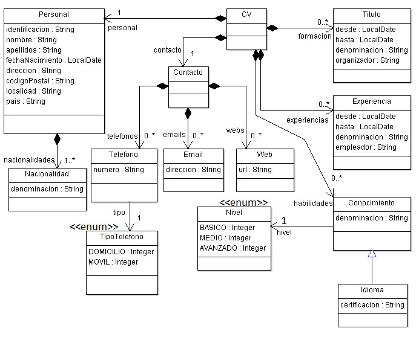

El aspecto de la GUI será el siguiente:

- __BARRA DE MENU__

La barra de menú tendrá dos menús: *"Archivo"* y *"Ayuda"*.

Desde el menú *"Archivo"* será posible hacer lo siguiente:

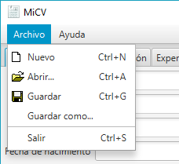

 — *"Nuevo"*: iniciar un CV nuevo (borrando el actual).     
 — *"Abrir..."*: cargar un CV desde fichero.     
 — *"Guardar"*: guardar el CV en el mismo fichero si se ha abierto, o guardar como...    
 — *"Guardar como..."*: guardar el CV en un fichero nuevo.      
 — *"Salir"*: termina la aplicación, pidiendo confirmación al usuario antes de salir.     

Desde el menú *"Ayuda"*:

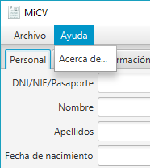

- __RAÍZ__

Se creará un controlador raíz (MainController), que será el controlador principal de la aplicación. La *"Application"* deberá tener una referencia a este controlador. Este controlador contendrá a su vez referencias al resto de controladores que se explicarán a continuación. Su vista (MainView) contendrá sólo la barra de menú, las menús y sus opciones, y el panel de pestañas y las pestañas vacías. El contenido de las pestañas irán en su controlador correspondiente. Ver apartados siguientes. Vamos a crear un árbol jerárquico de controladores, cada uno con su vista.

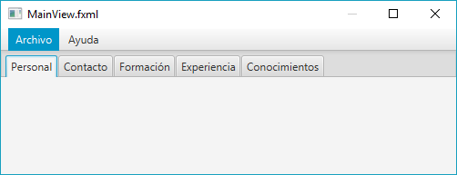

- __PESTAÑA: PERSONAL__

Desde aquí se gestionan todos los datos personales del *"CV"*. Se implementará un controlador (PersonalController) y una vista (PersonalView) a parte para esta pestaña, y será *"MainController"* quien meta a *"PersonalView"* en la pestaña correspondiente de *"MainView"*.

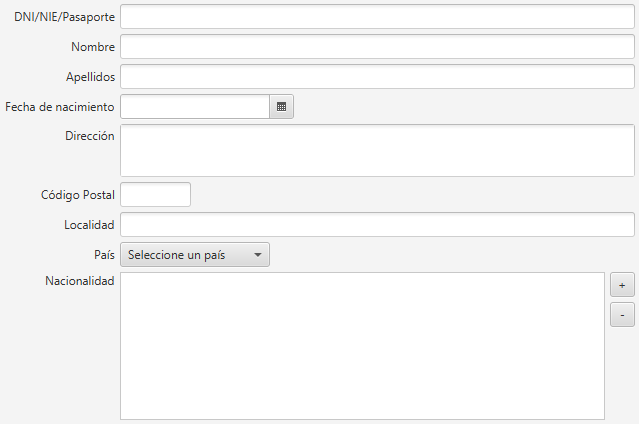

El botón *"+"* permite añadir una nueva nacionalidad a la lista de nacionalidades (ListView), a través de un cuadro de diálogo como el siguiente (ChoiceDialog):

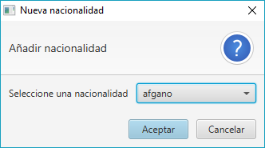

La lista de nacionalidades se podrá obtener del fichero adjunto *"nacionalidades.csv"*.

- __PESTAÑA: CONTACTO__

Desde aquí se gestionan todos los datos de contacto del *"CV"*. Se implementará un controlador (ContactoController) y una vista (ContactoView) a parte para esta pestaña, y será *"MainController"* quien meta a *"ContactoView"* en la pestaña correspondiente de *"MainView"*.

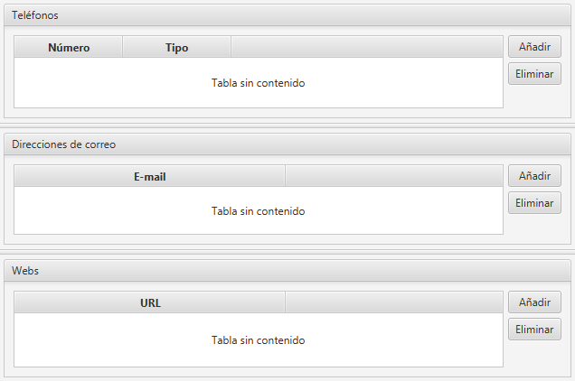

Para añadir teléfonos, direcciones de correo y páginas web se deben implementar mediante cuadros de diálogo personalizados (custom alerts) como los siguientes:

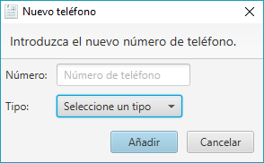 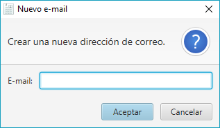 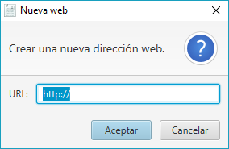

Para eliminar teléfonos, direcciones de correo o páginas web, se deberá seleccionar de la tabla y pulsar *"Eliminar"*; antes de eliminar, pedir confirmación al usuario mediante otro cuadro de diálogo (Alert).

Los datos se deberán poder editar directamente en la tabla.

**IMPORTANTE**: Para obtener más información sobre los cuadros de diálogo consultar el siguiente [enlace](https://code.makery.ch/blog/javafx-dialogs-official/).

- __PESTAÑA: FORMACIÓN__

Desde aquí se gestionan todos los datos de títulos/formación del *"CV"*. Se implementará un controlador (FormacionController) y una vista (FormacionView) a parte para esta pestaña, y será *"MainController"* quien meta a *"FormacionView"* en la pestaña correspondiente de *"MainView"*.

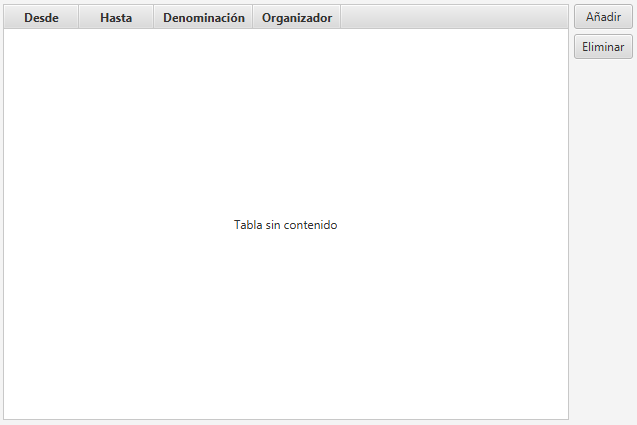

Para añadir un título en el apartado de formación se debe abrir una ventana como la siguiente:

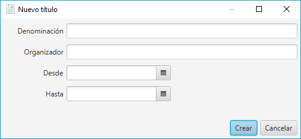

Para eliminar un título, se seleccionará de la tabla, se pulsará el botón *"Eliminar"* y se deberá pedir confirmación antes de eliminarlo.

Los datos se podrán editar directamente sobre la misma tabla.

- __PESTAÑA: EXPERIENCIA__

Desde aquí se gestionan todos los datos de experiencia laboral del *"CV"*. Se implementará un controlador (ExperienciaController) y una vista (ExperienciaView) a parte para esta pestaña, y será *"MainController"* quien meta a *"ExperienciaView"* en la pestaña correspondiente de *"MainView"*.

Para añadir una experiencia laboral en el apartado de experiencia se debe abrir una ventana como la siguiente:

Para eliminar una experiencia, se seleccionará de la tabla, se pulsará el botón *"Eliminar"* y se deberá pedir confirmación antes de eliminarla.

Los datos se podrán editar directamente sobre la misma tabla.

- __PESTAÑA: CONOCIMIENTOS__

Desde aquí se gestionan todos los datos de conocimientos/habilidades del *"CV"*. Se implementará un controlador (ConocimientosController) y una vista (ConocimientosView) a parte para esta pestaña, y será *"MainController"* quien meta a *"ConocimientosView"* en la pestaña correspondiente de *"MainView"*.

Para añadir un conocimiento/habilidad en el apartado de conocimientos se debe abrir una ventana como la siguiente:

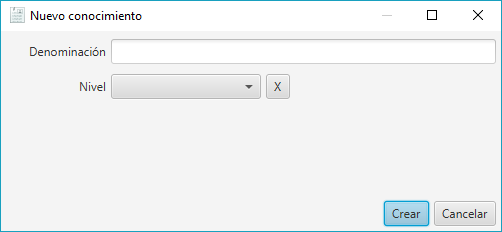

El botón *"X"* reiniciará el combo de nivel y lo dejará vacío (nulo).

Para añadir un idioma se abrirá otra ventana:

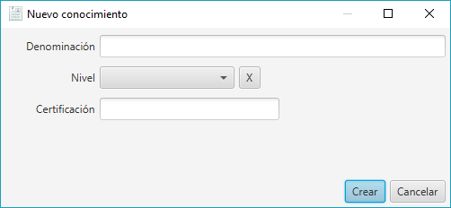

Para eliminar un conocimiento, se seleccionará de la tabla, se pulsará el botón "Eliminar" y se deberá pedir confirmación antes de eliminarlo.

Los datos se podrán editar directamente sobre la misma tabla.
